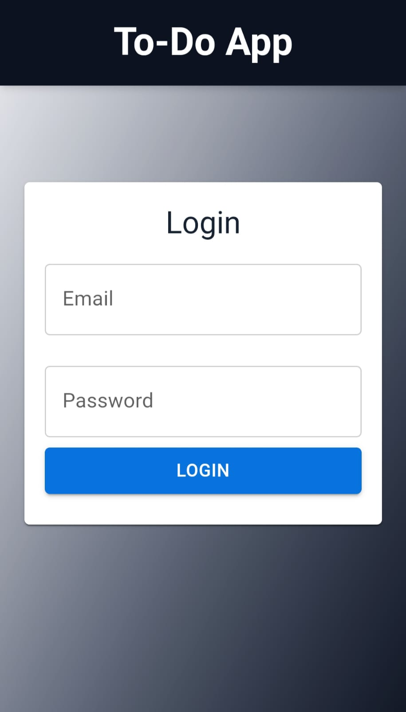
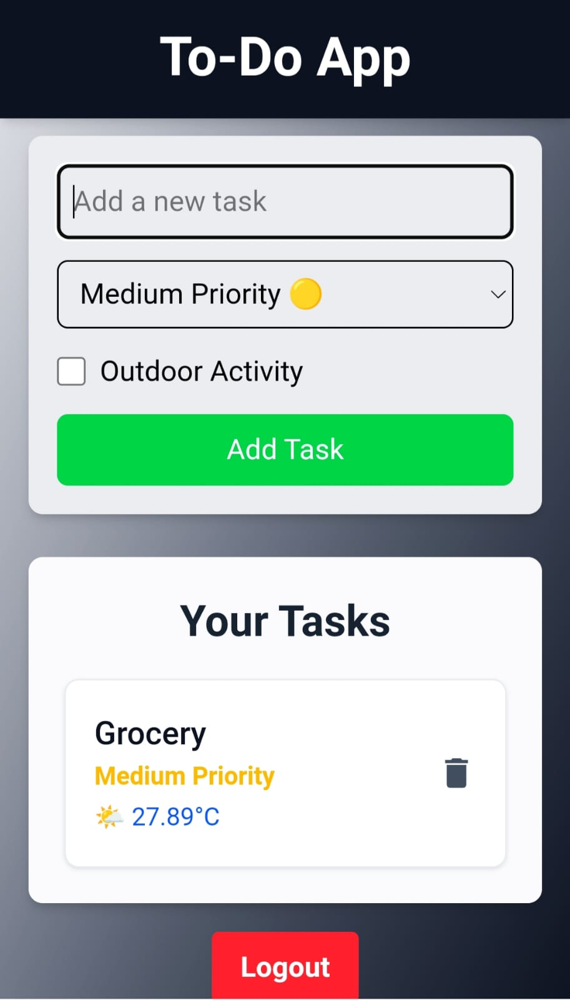

# To-Do App

A simple and efficient To-Do app built using React, Redux Toolkit, and Redux-Saga for state management, along with TailwindCSS for styling. The app supports user authentication, task management, and weather integration for outdoor tasks.

## Features

- User Authentication (Login/Logout)
- Protect tasks behind authentication (only visible to logged-in users)
- Add, Delete, and View Tasks
- Task Prioritization (High, Medium, Low)
- Outdoor Task Weather Integration (Fetched via Redux-Saga)
- Persistent User Session with LocalStorage

## Tech Stack

- **Frontend:** React, Redux Toolkit, Redux-Saga, TailwindCSS, Material-UI
- **State Management:** Redux Toolkit, Redux-Saga
- **Weather API Integration:** OpenWeather API (via Redux-Saga)
- **Authentication:** LocalStorage (Mock Authentication)

## Installation

### 1. Clone the Repository
```sh
git clone https://github.com/yourusername/todo-app.git
cd todo-app
```

### 2. Install Dependencies
```sh
npm install
```

### 3. Start the Development Server
```sh
npm run dev
```

The app will be available at `http://localhost:5173/`.

## User Authentication

This app implements a simple user authentication system using Redux Toolkit. Authentication is mocked using LocalStorage, ensuring that tasks are only visible to logged-in users.

- Users can log in by entering an email and password (no backend validation required).
- Upon login, the user session is stored in LocalStorage.
- Logged-in users can access the task list and manage tasks.
- Clicking "Logout" clears the session and hides tasks.

## Redux-Saga Usage
Redux-Saga is used for handling asynchronous side effects such as fetching weather data for outdoor tasks.

- `taskSaga.js` listens for `fetchWeatherRequest` action.
- Fetches weather data from OpenWeather API.
- Dispatches `fetchWeatherSuccess` or `fetchWeatherFailure` accordingly.

## Screenshots

### Home Screen


### Task List


## Deployment
The app is deployed on Render. You can access it here:

🔗 **Live Demo:**
https://to-do-app-czin.onrender.com/

 
 
